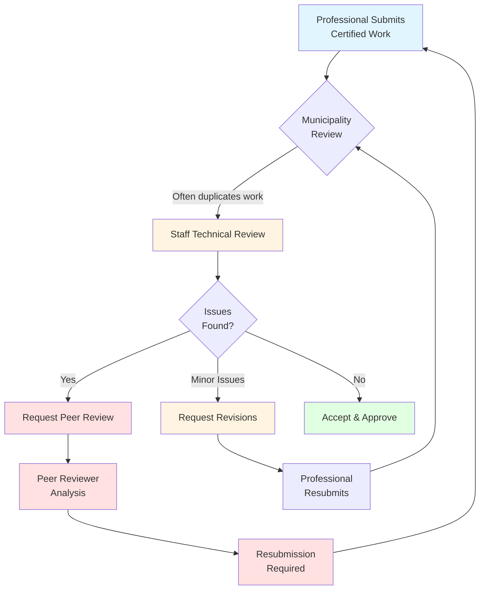
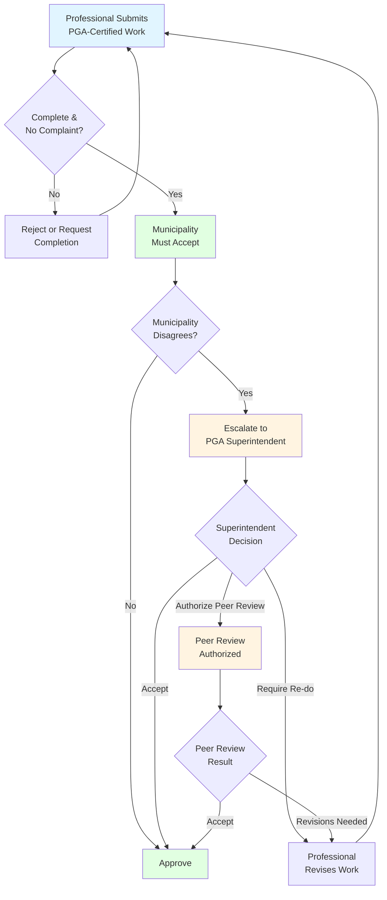

MLA George Anderson has proposed [Bill M 216](https://www.bclaws.gov.bc.ca/civix/document/id/bills/billscurrent/1st43rd:m216-1) and we're pretty excited about it. The bill does something elegantly simple: it lets local governments accept certified technical work from provincially regulated professionals, such as engineers, architects, technologists, so staff can focus on planning outcomes instead of re-doing work.

If a submission is certified by a professional regulated under the Professional Governance Act (PGA), the local government must accept it, unless it's incomplete or there's a formal complaint. That trims duplicative reviews without lowering standards. Municipalities still have a path forward to resolve disputes, however. If cities disagree with a report, it goes to the PGA superintendent to decide on whether the work should be re-done. Municipalities can't require peer reviews of certified submissions unless the superintendent authorizes it, which eliminates a common source of delay and cost. The certifying professional is liable for damages tied to their certification which means that cities are protected when relying on provided reports. Zoning, OCPs, DPs, and the Province's building codes are untouched; this reform targets process, not community vision.

## Current Process Overview

Under the current system, municipalities often duplicate technical reviews that professionals have already completed. When a certified professional submits their work, municipal staff may request peer reviews or additional revisions, creating feedback loops that can cycle multiple times before approval. This duplicative process adds months of delay and thousands of dollars in costs without necessarily improving outcomes.

## Proposed New Process (Bill M 216)

Bill M 216 introduces a streamlined path: municipalities must accept PGA-certified work unless it's incomplete or subject to a formal complaint. If a municipality disagrees with certified work, the dispute escalates to the PGA superintendent for resolution, rather than triggering automatic peer reviews or revision cycles. This creates a clear, efficient path to approval while maintaining accountability through professional liability and superintendent oversight.

So who are these professionals? The PGA covers bodies like Engineers and Geoscientists BC, the Architectural Institute of BC, Applied Science Technologists and Technicians of BC, among others.

Developments can be delayed due to slow, duplicative approvals. Streamlining the technical review process lets municipalities focus on more pressing matters while reducing the time and cost associated with duplicating provided work. Every extra review cycle means new drawings, new consultant hours, and more carrying costs. Cutting duplicative peer reviews can shave months and thousands of dollars from projects. Moreover, the introduction of clear acceptance rules and a defined escalation path means fewer stalls and resubmissions. 

The fun part is that this doesn’t weaken planning or public input at the municipal level. Council still sets zoning, creates Official Community Plans (OCPs), and Development Permit (DP) guidelines. And, projects still have to fit the community vision, they just won’t be re-engineered by City Hall when a professional has already stamped the work. 

> Guess what? The City of [Vancouver](https://vancouver.ca/home-property-development/certified-professional-program.aspx) and The City of [Surrey](https://www.surrey.ca/renovating-building-development/certified-professional-program) have already established Certified Professional programs. Not only that, The City of [Coquitlam](https://aibc.ca/programs-services/certified-professional-program/) has recently proposed their own program as well.

Cities like Nanaimo need thousands of small, incremental projects to meet the rising demand for housing. That means we need to make it easy to do the next small thing. This bill tries to cut down on friction without manipulating municipal rules and community plans, which is exactly the kind of low-drama, high-impact reform that helps this province mature. While [Bill M 216](https://www.bclaws.gov.bc.ca/civix/document/id/bills/billscurrent/1st43rd:m216-1) has yet to be adopted, Strong Towns Nanaimo is excited to see that streamlining development is still on the minds of our MLA. 
